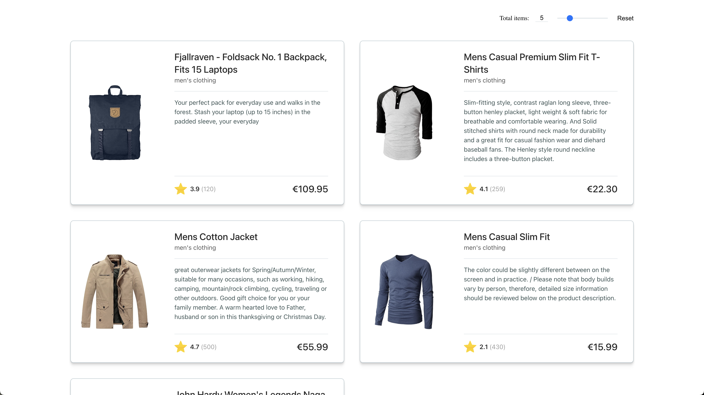

## Task 1. Create a list of products

The first task will be creating a listings page that contains a list of products retrieved by the external API.

Besides the list itself, there will be an input field, named limit field, which will allow the user to define the number of items that must be presented in the list. There should be an action to reset the limit number to its default value.

### Details

The API endpoint is:
- host: https://fakestoreapi.com
- path: /products
- query parameters:
    - limit (optional)
- example: https://fakestoreapi.com/products?limit=5

In the list, each product must display the following data:
- image
- title
- category
- description
- rate
    - floating point.
- rate count
- price
    - formatted in EUR.

The input for the limit field must have the following constraints:
- it should allow the user either introduce the limit via an input type number or via input type range - both must be visible and in sync.
- the default limit should be 5 items, and should be between 1 and 20.
- the list must be rendered after a change event occur in any if the input fields that compose the limit field.

The output should look something like the image bellow, however it is not required that they match 100%:

