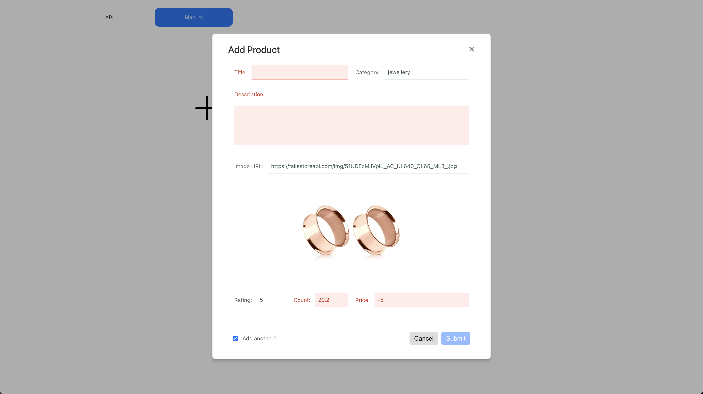
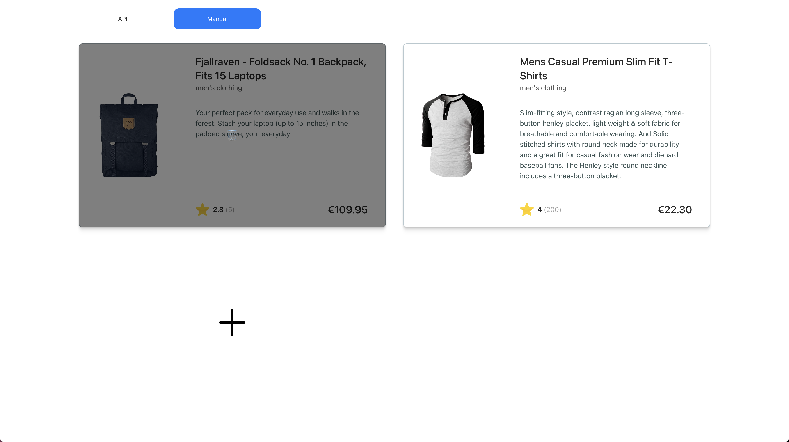

## Task 3. Add manual products

In this task you'll be in charge of adding a new listing page to the application. This new page will also contain a list of products, but instead of fetching them from the external API, you'll provide a way for the user to add them manually.

The goal is to create a form that allows the user to create a product in a different listing. The products in this listing are saved locally using IndexedDB.

The form must have the following controls:
- title
    - string
    - required
    - max-length: `100`
- category
    - string
    - required
    - max-length: `50`
- description
    - text
    - required
    - max-length: `500`
- image url
    - string
    - required
    - max-length: `500`
    - pattern: `^https?:\/\/.+\.(jpg|jpeg|png)$`
- rate
    - number
    - required
    - pattern: `^\d+\.?\d*$`
    - min: `1`
    - max: `5`
- rate count
    - number
    - required
    - pattern: `^\d+$`
    - min: `1`
- price
    - number
    - required
    - pattern: `^\d+\.?\d*$`
    - min: `1`

The output for the form component should look something like the image bellow, however it is not required that they match 100%:

As for the manual listing, it is very similar to what you've implemented in the first task, but instead of using the external API, you'll use a service that interacts with the indexedDB. In addition, it will have to communicate with the form modal to have automatic refreshes.

Finally, the user should able to delete the product by clicking on it. You'll have to display this action only when the mouse hovers the items.

The output for the manual form should look something like the image bellow, however it is not required that they match 100%:

In Summary, you'll have to:
- Implement the form component so that each field is displayed and validated accordingly. Also, take care of its submission - You must use Reactive forms in here.
- Style form component.
- Implement the interaction between the form modal and the manual listing in order to update it automatically.
- Add a delete manual product feature in the manual listing.
- Apply style changes to product manual list component.
- Use existing service to manipulate manual products in IndexedDB.

Implementation constraints:
- The form must be included inside a modal component, which already exists in the template provided.
- There must exist an image preview for valid URLs only, and it should be loaded automatically on value change.
- After submitting a new product, if the user checks the "Add another?" checkbox, instead of closing the modal, the form should be reset and the user may be able to add another one.
- After each product submitted, the manual list must be updated automatically.
- You don't need to focus in getting the UI perfect, however you must have it slightly responsive.
- Fix unit tests if needed.
- Ignore end-to-end tests.

Hints:
- Use `ProductsManualService` to manipulate data from IndexedDB.
- Use `ProductManualModalUiService` to load the form modal and receive submitted products from it.
- Checkout the form models in `src/app/core/interfaces/product-manual-form.interface.ts` file to manipulate the form data.
- Use the helper styles and design tokens present in `src/app/styles` folder to style your components - specially the styles in `_form.scss`.
